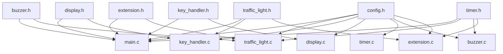

# 项目目录结构说明

## smart_traffic 目录结构

```
smart_traffic/
├── README.md                 # 项目主要文档
├── USER_MANUAL.md           # 用户操作手册
├── 设计方案.md              # 详细设计方案
├── 要求.md                  # 项目需求文档
├── config.h                 # 系统配置文件
├── main.c                   # 主程序入口
├── traffic_light.h          # 交通灯控制模块头文件
├── traffic_light.c          # 交通灯控制模块实现
├── key_handler.h            # 按键处理模块头文件
├── key_handler.c            # 按键处理模块实现
├── display.h                # 显示控制模块头文件
├── display.c                # 显示控制模块实现
├── timer.h                  # 定时器模块头文件
├── timer.c                  # 定时器模块实现
├── buzzer.h                 # 蜂鸣器模块头文件
├── buzzer.c                 # 蜂鸣器模块实现
├── extension.h              # 扩展功能模块头文件
├── extension.c              # 扩展功能模块实现
└── docs/                    # 文档目录
    ├── hardware/            # 硬件设计文档
    │   ├── schematic.pdf    # 原理图
    │   ├── pcb.pdf         # PCB设计图
    │   └── components.xlsx  # 器件清单
    ├── software/            # 软件设计文档
    │   ├── flowchart.pdf   # 程序流程图
    │   ├── api.md          # API说明文档
    │   └── test_report.md  # 测试报告
    └── images/              # 图片资源
        ├── system_arch.png # 系统架构图
        ├── pcb_layout.png  # PCB布局图
        └── prototype.jpg   # 实物照片
```

## 文件功能说明

### 核心源代码文件

#### config.h
- **功能**：系统配置中心
- **内容**：端口定义、参数配置、功能开关
- **特点**：高度可配置，便于移植

#### main.c
- **功能**：程序主入口和系统调度
- **内容**：系统初始化、主循环、任务调度
- **架构**：基于时间片的多任务调度

#### traffic_light.h/c
- **功能**：交通灯核心控制逻辑
- **内容**：状态机、时序控制、安全保护
- **接口**：状态设置、时间配置、紧急控制

#### key_handler.h/c
- **功能**：按键输入处理和参数设置
- **内容**：按键扫描、防抖处理、设置状态机
- **特性**：支持多级菜单、参数验证

#### display.h/c
- **功能**：数码管显示控制
- **内容**：动态扫描、亮度控制、闪烁效果
- **性能**：1ms刷新率，无闪烁显示

#### timer.h/c
- **功能**：系统时基和定时服务
- **内容**：多级定时器、中断处理、延时函数
- **精度**：1ms基础时钟，支持多种时间间隔

#### buzzer.h/c
- **功能**：蜂鸣器控制和声音提示
- **内容**：多种响声模式、音量控制、定时控制
- **模式**：连续响、短促响、脉冲响、警告声

#### extension.h/c
- **功能**：扩展功能和传感器接口
- **内容**：红外遥控、温度传感、风扇控制、通信协议
- **扩展性**：预留蓝牙、WiFi、网络接口

### 文档文件

#### README.md
- **目标读者**：开发者、用户、维护人员
- **内容覆盖**：项目概述、特性介绍、快速开始
- **详细程度**：中等，重点突出

#### USER_MANUAL.md
- **目标读者**：最终用户、操作人员
- **内容覆盖**：安装指南、操作说明、故障排除
- **详细程度**：详细，图文并茂

#### 设计方案.md
- **目标读者**：技术人员、评审专家
- **内容覆盖**：详细设计、技术方案、实现原理
- **详细程度**：最详细，技术深度高

#### 要求.md
- **目标读者**：开发团队、项目管理
- **内容覆盖**：功能需求、性能指标、验收标准
- **详细程度**：基础，需求导向

## 编译和构建

### Keil项目配置

1. **创建项目**：
   ```
   File -> New -> uVision Project
   选择：Atmel -> AT89C51
   ```

2. **添加文件**：
   ```
   Project -> Add Files to Group 'Source Group 1'
   添加所有 .c 文件
   ```

3. **编译设置**：
   ```
   Project -> Options for Target
   - Output: 选择 Create HEX File
   - Listing: 选择 Assembly Listing
   - C51: Optimization Level 1
   ```

### 文件依赖关系



## 代码规范

### 命名约定

1. **文件命名**：小写+下划线
   ```c
   traffic_light.h
   key_handler.c
   ```

2. **函数命名**：模块名_功能描述
   ```c
   TrafficLight_Init()
   Key_SetModeHandler()
   Display_ShowTime()
   ```

3. **变量命名**：驼峰命名法
   ```c
   nsLight          // 南北交通灯
   displayMode      // 显示模式
   systemConfig     // 系统配置
   ```

4. **宏定义命名**：全大写+下划线
   ```c
   DEFAULT_GREEN_TIME
   ENABLE_BUZZER
   NS_RED_PIN
   ```

### 代码风格

1. **缩进**：4个空格
2. **大括号**：K&R风格
3. **注释**：Doxygen格式
4. **行长度**：不超过100字符

### 模块接口设计原则

1. **单一职责**：每个模块专注一个功能域
2. **接口简洁**：最小化公开接口
3. **参数验证**：所有输入参数都要验证
4. **错误处理**：统一的错误码和处理机制
5. **可配置性**：通过config.h集中配置

## 版本管理

### Git工作流

```
main分支          ●---●---●---●  (稳定版本)
                 /           /
feature分支     ●---●---●---●    (功能开发)
               /
hotfix分支    ●---●             (紧急修复)
```

### 版本号规则

- **主版本号**：重大架构变更
- **次版本号**：新功能添加
- **修订版本号**：Bug修复

例如：v1.0.0 → v1.1.0 → v1.1.1

### 提交信息规范

```
feat: 添加红外遥控功能
fix: 修复数码管闪烁问题  
docs: 更新用户手册
test: 添加温度传感器测试用例
refactor: 重构按键处理逻辑
```

## 质量保证

### 代码审查清单

- [ ] 是否遵循命名规范
- [ ] 是否有充分的注释
- [ ] 是否处理了错误情况
- [ ] 是否有内存泄漏风险
- [ ] 是否符合模块化设计原则

### 测试覆盖要求

- **单元测试**：核心函数覆盖率 > 80%
- **集成测试**：模块间接口全覆盖
- **系统测试**：用户场景全覆盖
- **压力测试**：长期运行稳定性

---

**维护说明**：本文档随代码更新而更新，确保与实际代码保持同步。